<!--
title: '📖 MARKDOWN'
description: 'One stub that keeps a README drawn: banners, badges, trophies and elements, each measured from the repository at its own hour and committed only when something moved.'
tags: [readme, readme-header, readme-badges, readme-trophies, github-actions, reusable-workflow, svg, blueprint]
category: docs
-->

<!-- banners:header:start -->
<!-- markdownlint-disable MD041 -->

<div align="center">

<a name="top"></a>

<picture>
  <source media="(max-width: 585px) and (prefers-color-scheme: dark)" srcset="assets/banners/header-narrow-dark.svg">
  <source media="(max-width: 585px)" srcset="assets/banners/header-narrow-day.svg">
  <source media="(prefers-reduced-motion: reduce) and (prefers-color-scheme: dark)" srcset="assets/banners/header-still-dark.svg">
  <source media="(prefers-reduced-motion: reduce)" srcset="assets/banners/header-still-day.svg">
  <source media="(prefers-color-scheme: dark)" srcset="assets/banners/header-dark.svg">
  
</picture>

</div>
<!-- banners:header:end -->

<div align="center">

<a href="./"><picture><source media="(prefers-color-scheme: dark)" srcset="assets/badges/static/status-dark.svg"></picture></a>
<a href="./"><picture><source media="(prefers-color-scheme: dark)" srcset="assets/badges/static/role-dark.svg"></picture></a>
<a href="./"><picture><source media="(prefers-color-scheme: dark)" srcset="assets/badges/static/context-dark.svg"></picture></a>
<a href="./LICENSE"><picture><source media="(prefers-color-scheme: dark)" srcset="assets/badges/static/license-dark.svg"></picture></a>

<a href="#-the-kits"><picture><source media="(prefers-color-scheme: dark)" srcset="assets/badges/static/kits-dark.svg"></picture></a>
<a href="#-one-stub-three-slots"><picture><source media="(prefers-color-scheme: dark)" srcset="assets/badges/static/slots-dark.svg"></picture></a>
<a href="#-one-stub-three-slots"><picture><source media="(prefers-color-scheme: dark)" srcset="assets/badges/static/apart-dark.svg"></picture></a>

</div>

---

## 💡 What This Is

Four kits each keep one part of a README current, and each has a stub of
its own. This repository holds the **one workflow that calls all of them**,
so a repository adds a single stub, names an hour for each generator, and
gets a page that measures itself and commits what changed. Nothing here
draws anything: each kit stays in its own repository, on its own release
line, and is called by link.

| Kit          | Draws                                                                                                          | Lives in                                                                                     | Slot                |
| :----------- | :------------------------------------------------------------------------------------------------------------- | :------------------------------------------------------------------------------------------- | :------------------ |
| **banners**  | The header at the top of the page and the footer at its foot, from what GitHub knows about the repository      | [`tannergolden/banners`](https://github.com/tannergolden/banners)                            | 00:07               |
| **elements** | The body of the page: a schematic, instruments, milestones, a roster, a certificate, placards, a seal              | [`tannergolden/banners`](https://github.com/tannergolden/banners), beside the banners    | 00:07, after them   |
| **badges**   | The badges under the header, from one data file, in six styles and their blueprint twins                        | [`tannergolden/badges`](https://github.com/tannergolden/badges)                              | 08:07               |
| **trophies** | The case: the trophies and achievements the repository has earned                                               | [`tannergolden/trophies`](https://github.com/tannergolden/trophies)                          | 16:07               |

Every one of them draws **committed SVGs** on the same drafting paper, in the
same eleven prints, lettered with the same outlines, so a page drawn by all
four reads as one set of engineering drawings. No request at view time,
nothing to rate-limit, and nothing to keep in step by hand.

**Called, never copied.** Your repository holds a stub that names three
crons. This workflow runs the right kit when each fires, and each kit does
its measuring, drawing and committing in its own repository, so a fix to any
of them lands once and reaches every README pinned to `v1`. That is the
rule every one of these repositories follows, published in
[`tannergolden/standards`](https://github.com/tannergolden/standards).

---

## 🕗 One Stub, Three Slots

There are three generator repositories, so there are three slots in a day,
**eight hours apart**: the banners and the elements at seven minutes past
midnight, the badges at seven past eight, the trophies at seven past four.
A repository is committed to at most once in each slot, and a slot in which
nothing that kit shows has moved commits nothing at all. A manual run, from
the Actions tab, draws everything, one kit after another, so no two ever
push at once.

The stub says each cron twice: once under `on.schedule`, so GitHub fires
it, and once under `with:`, so the workflow knows which kit it means. On a
schedule the workflow reads which cron fired and runs that kit alone; on any
other event it runs every kit the stub names. A cron that fires and names no
kit fails loudly rather than drawing the wrong thing.

<!-- elements:how-it-runs:start -->
<picture>
  <source media="(max-width: 585px) and (prefers-color-scheme: dark)" srcset="assets/elements/how-it-runs-narrow-dark.svg">
  <source media="(max-width: 585px)" srcset="assets/elements/how-it-runs-narrow-day.svg">
  <source media="(prefers-color-scheme: dark)" srcset="assets/elements/how-it-runs-dark.svg">
  
</picture>
<!-- elements:how-it-runs:end -->

---

## 🖼️ This Page, Drawn By Itself

The header at the top of this page and the footer at its foot are the
banners; the badges under the header are the badges; the rest of this
chapter is the elements and the trophies. All of it is drawn for this
repository by [`📖 Own README`](.github/workflows/own-readme.yml), which
calls the same workflow you would, at the same three crons. Nothing on this
page is fetched from anywhere.

### The body

The elements read this repository's git history in the banners slot: commits
per week and the days since the last release, the releases on a time line,
who drew it, and the checks it passes. Only the notes on the releases and the
words on the certificate's ring are written by hand, in
[`.github/elements.yml`](.github/elements.yml).

<!-- elements:vitals:start -->
<picture>
  <source media="(max-width: 585px) and (prefers-color-scheme: dark)" srcset="assets/elements/vitals-narrow-dark.svg">
  <source media="(max-width: 585px)" srcset="assets/elements/vitals-narrow-day.svg">
  <source media="(prefers-color-scheme: dark)" srcset="assets/elements/vitals-dark.svg">
  
</picture>
<!-- elements:vitals:end -->

<!-- elements:history:start -->
<picture>
  <source media="(max-width: 585px) and (prefers-color-scheme: dark)" srcset="assets/elements/history-narrow-dark.svg">
  <source media="(max-width: 585px)" srcset="assets/elements/history-narrow-day.svg">
  <source media="(prefers-color-scheme: dark)" srcset="assets/elements/history-dark.svg">
  
</picture>
<!-- elements:history:end -->

<div align="center">

<!-- elements:contributors:start -->
<picture>
  <source media="(prefers-color-scheme: dark)" srcset="assets/elements/contributors-dark.svg">
  
</picture>
<!-- elements:contributors:end -->
<!-- elements:conformance:start -->
<picture>
  <source media="(prefers-color-scheme: dark)" srcset="assets/elements/conformance-dark.svg">
  
</picture>
<!-- elements:conformance:end -->

</div>

### The case

The trophies read this repository in the trophies slot: stars from other
people, forks, contributors, commits, releases, merged pull requests, issues
resolved and active days, with a hundred achievements behind them. A new
repository starts with an empty case, which is the honest one.

<!-- trophies:start -->

<p align="center">
  <picture><source media="(prefers-color-scheme: dark)" srcset="assets/trophies/level.svg">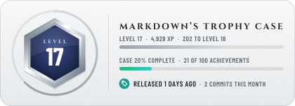</picture>
  <picture><source media="(prefers-color-scheme: dark)" srcset="assets/trophies/next-up.svg">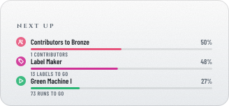</picture>
</p>

<p align="center">
  <a href="https://github.com/tannergolden/trophies/blob/HEAD/docs/Catalogue.md#repository-stars"><picture><source media="(prefers-color-scheme: dark)" srcset="assets/trophies/stars.svg">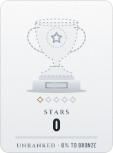</picture></a>
  <a href="https://github.com/tannergolden/trophies/blob/HEAD/docs/Catalogue.md#repository-forks"><picture><source media="(prefers-color-scheme: dark)" srcset="assets/trophies/forks.svg"></picture></a>
  <a href="https://github.com/tannergolden/trophies/blob/HEAD/docs/Catalogue.md#repository-contributors"><picture><source media="(prefers-color-scheme: dark)" srcset="assets/trophies/contributors.svg">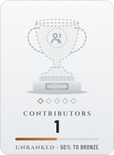</picture></a>
  <a href="https://github.com/tannergolden/trophies/blob/HEAD/docs/Catalogue.md#repository-commits"><picture><source media="(prefers-color-scheme: dark)" srcset="assets/trophies/commits.svg">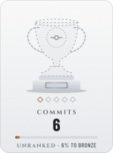</picture></a>
  <a href="https://github.com/tannergolden/trophies/blob/HEAD/docs/Catalogue.md#repository-releases"><picture><source media="(prefers-color-scheme: dark)" srcset="assets/trophies/releases.svg"></picture></a>
  <a href="https://github.com/tannergolden/trophies/blob/HEAD/docs/Catalogue.md#repository-merged"><picture><source media="(prefers-color-scheme: dark)" srcset="assets/trophies/merged.svg">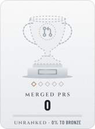</picture></a>
  <a href="https://github.com/tannergolden/trophies/blob/HEAD/docs/Catalogue.md#repository-resolved"><picture><source media="(prefers-color-scheme: dark)" srcset="assets/trophies/resolved.svg"></picture></a>
  <a href="https://github.com/tannergolden/trophies/blob/HEAD/docs/Catalogue.md#repository-active"><picture><source media="(prefers-color-scheme: dark)" srcset="assets/trophies/active.svg"></picture></a>
</p>

<details>
<summary><b>Achievements</b> · 20 of 100 earned · next: Contributors to Bronze, 50%</summary>

<p align="center"><b>Launch</b></p>
<p align="center">
  <a href="https://github.com/tannergolden/trophies/blob/HEAD/docs/Catalogue.md#repository-first-release"><picture><source media="(prefers-color-scheme: dark)" srcset="assets/trophies/achievements/first-release.svg"></picture></a>
  <a href="https://github.com/tannergolden/trophies/blob/HEAD/docs/Catalogue.md#repository-first-tag"><picture><source media="(prefers-color-scheme: dark)" srcset="assets/trophies/achievements/first-tag.svg"></picture></a>
  <a href="https://github.com/tannergolden/trophies/blob/HEAD/docs/Catalogue.md#repository-stranger-report"><picture><source media="(prefers-color-scheme: dark)" srcset="assets/trophies/achievements/stranger-report.svg"></picture></a>
  <a href="https://github.com/tannergolden/trophies/blob/HEAD/docs/Catalogue.md#repository-named"><picture><source media="(prefers-color-scheme: dark)" srcset="assets/trophies/achievements/named.svg"></picture></a>
  <a href="https://github.com/tannergolden/trophies/blob/HEAD/docs/Catalogue.md#repository-filed"><picture><source media="(prefers-color-scheme: dark)" srcset="assets/trophies/achievements/filed.svg">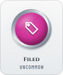</picture></a>
  <a href="https://github.com/tannergolden/trophies/blob/HEAD/docs/Catalogue.md#repository-first-fork"><picture><source media="(prefers-color-scheme: dark)" srcset="assets/trophies/achievements/first-fork.svg">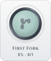</picture></a>
  <a href="https://github.com/tannergolden/trophies/blob/HEAD/docs/Catalogue.md#repository-first-merge"><picture><source media="(prefers-color-scheme: dark)" srcset="assets/trophies/achievements/first-merge.svg"></picture></a>
  <a href="https://github.com/tannergolden/trophies/blob/HEAD/docs/Catalogue.md#repository-first-star"><picture><source media="(prefers-color-scheme: dark)" srcset="assets/trophies/achievements/first-star.svg"></picture></a>
  <a href="https://github.com/tannergolden/trophies/blob/HEAD/docs/Catalogue.md#repository-first-watcher"><picture><source media="(prefers-color-scheme: dark)" srcset="assets/trophies/achievements/first-watcher.svg"></picture></a>
  <a href="https://github.com/tannergolden/trophies/blob/HEAD/docs/Catalogue.md#repository-front-door"><picture><source media="(prefers-color-scheme: dark)" srcset="assets/trophies/achievements/front-door.svg"></picture></a>
  <a href="https://github.com/tannergolden/trophies/blob/HEAD/docs/Catalogue.md#repository-outside-help"><picture><source media="(prefers-color-scheme: dark)" srcset="assets/trophies/achievements/outside-help.svg"></picture></a>
  <a href="https://github.com/tannergolden/trophies/blob/HEAD/docs/Catalogue.md#repository-poster"><picture><source media="(prefers-color-scheme: dark)" srcset="assets/trophies/achievements/poster.svg">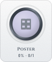</picture></a>
</p>

<p align="center"><b>Health</b></p>
<p align="center">
  <a href="https://github.com/tannergolden/trophies/blob/HEAD/docs/Catalogue.md#repository-gatekeeper"><picture><source media="(prefers-color-scheme: dark)" srcset="assets/trophies/achievements/gatekeeper.svg"></picture></a>
  <a href="https://github.com/tannergolden/trophies/blob/HEAD/docs/Catalogue.md#repository-locksmith"><picture><source media="(prefers-color-scheme: dark)" srcset="assets/trophies/achievements/locksmith.svg"></picture></a>
  <a href="https://github.com/tannergolden/trophies/blob/HEAD/docs/Catalogue.md#repository-auto-pilot"><picture><source media="(prefers-color-scheme: dark)" srcset="assets/trophies/achievements/auto-pilot.svg"></picture></a>
  <a href="https://github.com/tannergolden/trophies/blob/HEAD/docs/Catalogue.md#repository-house-rules"><picture><source media="(prefers-color-scheme: dark)" srcset="assets/trophies/achievements/house-rules.svg"></picture></a>
  <a href="https://github.com/tannergolden/trophies/blob/HEAD/docs/Catalogue.md#repository-well-formed"><picture><source media="(prefers-color-scheme: dark)" srcset="assets/trophies/achievements/well-formed.svg">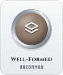</picture></a>
  <a href="https://github.com/tannergolden/trophies/blob/HEAD/docs/Catalogue.md#repository-clean-bill"><picture><source media="(prefers-color-scheme: dark)" srcset="assets/trophies/achievements/clean-bill.svg"></picture></a>
  <a href="https://github.com/tannergolden/trophies/blob/HEAD/docs/Catalogue.md#repository-documented"><picture><source media="(prefers-color-scheme: dark)" srcset="assets/trophies/achievements/documented.svg">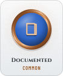</picture></a>
  <a href="https://github.com/tannergolden/trophies/blob/HEAD/docs/Catalogue.md#repository-licensed"><picture><source media="(prefers-color-scheme: dark)" srcset="assets/trophies/achievements/licensed.svg"></picture></a>
  <a href="https://github.com/tannergolden/trophies/blob/HEAD/docs/Catalogue.md#repository-label-maker"><picture><source media="(prefers-color-scheme: dark)" srcset="assets/trophies/achievements/label-maker.svg"></picture></a>
  <a href="https://github.com/tannergolden/trophies/blob/HEAD/docs/Catalogue.md#repository-changelog"><picture><source media="(prefers-color-scheme: dark)" srcset="assets/trophies/achievements/changelog.svg"></picture></a>
  <a href="https://github.com/tannergolden/trophies/blob/HEAD/docs/Catalogue.md#repository-form-filler"><picture><source media="(prefers-color-scheme: dark)" srcset="assets/trophies/achievements/form-filler.svg">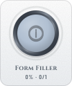</picture></a>
  <a href="https://github.com/tannergolden/trophies/blob/HEAD/docs/Catalogue.md#repository-open-hand"><picture><source media="(prefers-color-scheme: dark)" srcset="assets/trophies/achievements/open-hand.svg">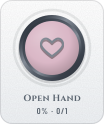</picture></a>
  <a href="https://github.com/tannergolden/trophies/blob/HEAD/docs/Catalogue.md#repository-paperwork"><picture><source media="(prefers-color-scheme: dark)" srcset="assets/trophies/achievements/paperwork.svg"></picture></a>
  <a href="https://github.com/tannergolden/trophies/blob/HEAD/docs/Catalogue.md#repository-protected"><picture><source media="(prefers-color-scheme: dark)" srcset="assets/trophies/achievements/protected.svg"></picture></a>
  <a href="https://github.com/tannergolden/trophies/blob/HEAD/docs/Catalogue.md#repository-roadmap"><picture><source media="(prefers-color-scheme: dark)" srcset="assets/trophies/achievements/roadmap.svg"></picture></a>
  <a href="https://github.com/tannergolden/trophies/blob/HEAD/docs/Catalogue.md#repository-support-line"><picture><source media="(prefers-color-scheme: dark)" srcset="assets/trophies/achievements/support-line.svg"></picture></a>
  <a href="https://github.com/tannergolden/trophies/blob/HEAD/docs/Catalogue.md#repository-town-hall"><picture><source media="(prefers-color-scheme: dark)" srcset="assets/trophies/achievements/town-hall.svg"></picture></a>
  <a href="https://github.com/tannergolden/trophies/blob/HEAD/docs/Catalogue.md#repository-welcome-mat"><picture><source media="(prefers-color-scheme: dark)" srcset="assets/trophies/achievements/welcome-mat.svg">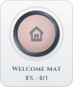</picture></a>
</p>

<p align="center"><b>Craft</b></p>
<p align="center">
  <a href="https://github.com/tannergolden/trophies/blob/HEAD/docs/Catalogue.md#repository-follows-the-standards"><picture><source media="(prefers-color-scheme: dark)" srcset="assets/trophies/achievements/follows-the-standards.svg"></picture></a>
  <a href="https://github.com/tannergolden/trophies/blob/HEAD/docs/Catalogue.md#repository-golden-path"><picture><source media="(prefers-color-scheme: dark)" srcset="assets/trophies/achievements/golden-path.svg"></picture></a>
  <a href="https://github.com/tannergolden/trophies/blob/HEAD/docs/Catalogue.md#repository-ready-room"><picture><source media="(prefers-color-scheme: dark)" srcset="assets/trophies/achievements/ready-room.svg"></picture></a>
  <a href="https://github.com/tannergolden/trophies/blob/HEAD/docs/Catalogue.md#repository-wired"><picture><source media="(prefers-color-scheme: dark)" srcset="assets/trophies/achievements/wired.svg"></picture></a>
  <a href="https://github.com/tannergolden/trophies/blob/HEAD/docs/Catalogue.md#repository-squeaky"><picture><source media="(prefers-color-scheme: dark)" srcset="assets/trophies/achievements/squeaky.svg">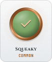</picture></a>
  <a href="https://github.com/tannergolden/trophies/blob/HEAD/docs/Catalogue.md#repository-green-machine"><picture><source media="(prefers-color-scheme: dark)" srcset="assets/trophies/achievements/green-machine.svg">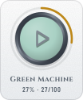</picture></a>
  <a href="https://github.com/tannergolden/trophies/blob/HEAD/docs/Catalogue.md#repository-release-notes"><picture><source media="(prefers-color-scheme: dark)" srcset="assets/trophies/achievements/release-notes.svg"></picture></a>
  <a href="https://github.com/tannergolden/trophies/blob/HEAD/docs/Catalogue.md#repository-semver"><picture><source media="(prefers-color-scheme: dark)" srcset="assets/trophies/achievements/semver.svg"></picture></a>
  <a href="https://github.com/tannergolden/trophies/blob/HEAD/docs/Catalogue.md#repository-by-the-book"><picture><source media="(prefers-color-scheme: dark)" srcset="assets/trophies/achievements/by-the-book.svg"></picture></a>
  <a href="https://github.com/tannergolden/trophies/blob/HEAD/docs/Catalogue.md#repository-containerized"><picture><source media="(prefers-color-scheme: dark)" srcset="assets/trophies/achievements/containerized.svg">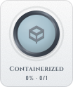</picture></a>
  <a href="https://github.com/tannergolden/trophies/blob/HEAD/docs/Catalogue.md#repository-gitmoji"><picture><source media="(prefers-color-scheme: dark)" srcset="assets/trophies/achievements/gitmoji.svg">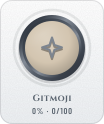</picture></a>
  <a href="https://github.com/tannergolden/trophies/blob/HEAD/docs/Catalogue.md#repository-packager"><picture><source media="(prefers-color-scheme: dark)" srcset="assets/trophies/achievements/packager.svg">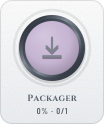</picture></a>
  <a href="https://github.com/tannergolden/trophies/blob/HEAD/docs/Catalogue.md#repository-prerelease"><picture><source media="(prefers-color-scheme: dark)" srcset="assets/trophies/achievements/prerelease.svg"></picture></a>
  <a href="https://github.com/tannergolden/trophies/blob/HEAD/docs/Catalogue.md#repository-signed"><picture><source media="(prefers-color-scheme: dark)" srcset="assets/trophies/achievements/signed.svg">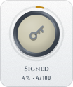</picture></a>
  <a href="https://github.com/tannergolden/trophies/blob/HEAD/docs/Catalogue.md#repository-small-steps"><picture><source media="(prefers-color-scheme: dark)" srcset="assets/trophies/achievements/small-steps.svg"></picture></a>
  <a href="https://github.com/tannergolden/trophies/blob/HEAD/docs/Catalogue.md#repository-test-suite"><picture><source media="(prefers-color-scheme: dark)" srcset="assets/trophies/achievements/test-suite.svg"></picture></a>
</p>

<p align="center"><b>Community</b></p>
<p align="center">
  <a href="https://github.com/tannergolden/trophies/blob/HEAD/docs/Catalogue.md#repository-triage"><picture><source media="(prefers-color-scheme: dark)" srcset="assets/trophies/achievements/triage.svg"></picture></a>
  <a href="https://github.com/tannergolden/trophies/blob/HEAD/docs/Catalogue.md#repository-crew"><picture><source media="(prefers-color-scheme: dark)" srcset="assets/trophies/achievements/crew.svg"></picture></a>
  <a href="https://github.com/tannergolden/trophies/blob/HEAD/docs/Catalogue.md#repository-ten-strong"><picture><source media="(prefers-color-scheme: dark)" srcset="assets/trophies/achievements/ten-strong.svg">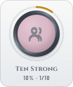</picture></a>
  <a href="https://github.com/tannergolden/trophies/blob/HEAD/docs/Catalogue.md#repository-long-thread"><picture><source media="(prefers-color-scheme: dark)" srcset="assets/trophies/achievements/long-thread.svg"></picture></a>
  <a href="https://github.com/tannergolden/trophies/blob/HEAD/docs/Catalogue.md#repository-talkative"><picture><source media="(prefers-color-scheme: dark)" srcset="assets/trophies/achievements/talkative.svg">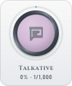</picture></a>
  <a href="https://github.com/tannergolden/trophies/blob/HEAD/docs/Catalogue.md#repository-answered"><picture><source media="(prefers-color-scheme: dark)" srcset="assets/trophies/achievements/answered.svg"></picture></a>
  <a href="https://github.com/tannergolden/trophies/blob/HEAD/docs/Catalogue.md#repository-fast-reply"><picture><source media="(prefers-color-scheme: dark)" srcset="assets/trophies/achievements/fast-reply.svg"></picture></a>
  <a href="https://github.com/tannergolden/trophies/blob/HEAD/docs/Catalogue.md#repository-good-first-issues"><picture><source media="(prefers-color-scheme: dark)" srcset="assets/trophies/achievements/good-first-issues.svg">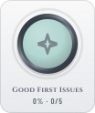</picture></a>
  <a href="https://github.com/tannergolden/trophies/blob/HEAD/docs/Catalogue.md#repository-help-wanted"><picture><source media="(prefers-color-scheme: dark)" srcset="assets/trophies/achievements/help-wanted.svg">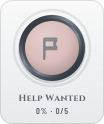</picture></a>
  <a href="https://github.com/tannergolden/trophies/blob/HEAD/docs/Catalogue.md#repository-mentor"><picture><source media="(prefers-color-scheme: dark)" srcset="assets/trophies/achievements/mentor.svg"></picture></a>
  <a href="https://github.com/tannergolden/trophies/blob/HEAD/docs/Catalogue.md#repository-org-backed"><picture><source media="(prefers-color-scheme: dark)" srcset="assets/trophies/achievements/org-backed.svg"></picture></a>
  <a href="https://github.com/tannergolden/trophies/blob/HEAD/docs/Catalogue.md#repository-outside-merges"><picture><source media="(prefers-color-scheme: dark)" srcset="assets/trophies/achievements/outside-merges.svg"></picture></a>
  <a href="https://github.com/tannergolden/trophies/blob/HEAD/docs/Catalogue.md#repository-popular-opinion"><picture><source media="(prefers-color-scheme: dark)" srcset="assets/trophies/achievements/popular-opinion.svg"></picture></a>
  <a href="https://github.com/tannergolden/trophies/blob/HEAD/docs/Catalogue.md#repository-regulars"><picture><source media="(prefers-color-scheme: dark)" srcset="assets/trophies/achievements/regulars.svg"></picture></a>
  <a href="https://github.com/tannergolden/trophies/blob/HEAD/docs/Catalogue.md#repository-reviewed"><picture><source media="(prefers-color-scheme: dark)" srcset="assets/trophies/achievements/reviewed.svg"></picture></a>
  <a href="https://github.com/tannergolden/trophies/blob/HEAD/docs/Catalogue.md#repository-well-maintained"><picture><source media="(prefers-color-scheme: dark)" srcset="assets/trophies/achievements/well-maintained.svg"></picture></a>
</p>

<p align="center"><b>Reach</b></p>
<p align="center">
  <a href="https://github.com/tannergolden/trophies/blob/HEAD/docs/Catalogue.md#repository-big-name"><picture><source media="(prefers-color-scheme: dark)" srcset="assets/trophies/achievements/big-name.svg"></picture></a>
  <a href="https://github.com/tannergolden/trophies/blob/HEAD/docs/Catalogue.md#repository-cloned"><picture><source media="(prefers-color-scheme: dark)" srcset="assets/trophies/achievements/cloned.svg">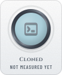</picture></a>
  <a href="https://github.com/tannergolden/trophies/blob/HEAD/docs/Catalogue.md#repository-downloaded"><picture><source media="(prefers-color-scheme: dark)" srcset="assets/trophies/achievements/downloaded.svg"></picture></a>
  <a href="https://github.com/tannergolden/trophies/blob/HEAD/docs/Catalogue.md#repository-fork-magnet"><picture><source media="(prefers-color-scheme: dark)" srcset="assets/trophies/achievements/fork-magnet.svg">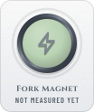</picture></a>
  <a href="https://github.com/tannergolden/trophies/blob/HEAD/docs/Catalogue.md#repository-forked-far"><picture><source media="(prefers-color-scheme: dark)" srcset="assets/trophies/achievements/forked-far.svg">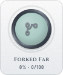</picture></a>
  <a href="https://github.com/tannergolden/trophies/blob/HEAD/docs/Catalogue.md#repository-living-forks"><picture><source media="(prefers-color-scheme: dark)" srcset="assets/trophies/achievements/living-forks.svg">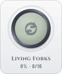</picture></a>
  <a href="https://github.com/tannergolden/trophies/blob/HEAD/docs/Catalogue.md#repository-referred"><picture><source media="(prefers-color-scheme: dark)" srcset="assets/trophies/achievements/referred.svg">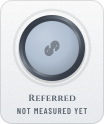</picture></a>
  <a href="https://github.com/tannergolden/trophies/blob/HEAD/docs/Catalogue.md#repository-registry"><picture><source media="(prefers-color-scheme: dark)" srcset="assets/trophies/achievements/registry.svg"></picture></a>
  <a href="https://github.com/tannergolden/trophies/blob/HEAD/docs/Catalogue.md#repository-star-of-the-week"><picture><source media="(prefers-color-scheme: dark)" srcset="assets/trophies/achievements/star-of-the-week.svg"></picture></a>
  <a href="https://github.com/tannergolden/trophies/blob/HEAD/docs/Catalogue.md#repository-stargazer-streak"><picture><source media="(prefers-color-scheme: dark)" srcset="assets/trophies/achievements/stargazer-streak.svg">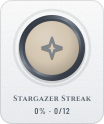</picture></a>
  <a href="https://github.com/tannergolden/trophies/blob/HEAD/docs/Catalogue.md#repository-trending"><picture><source media="(prefers-color-scheme: dark)" srcset="assets/trophies/achievements/trending.svg"></picture></a>
  <a href="https://github.com/tannergolden/trophies/blob/HEAD/docs/Catalogue.md#repository-used-by"><picture><source media="(prefers-color-scheme: dark)" srcset="assets/trophies/achievements/used-by.svg"></picture></a>
  <a href="https://github.com/tannergolden/trophies/blob/HEAD/docs/Catalogue.md#repository-visited"><picture><source media="(prefers-color-scheme: dark)" srcset="assets/trophies/achievements/visited.svg"></picture></a>
  <a href="https://github.com/tannergolden/trophies/blob/HEAD/docs/Catalogue.md#repository-watched"><picture><source media="(prefers-color-scheme: dark)" srcset="assets/trophies/achievements/watched.svg"></picture></a>
</p>

<p align="center"><b>Rhythm</b></p>
<p align="center">
  <a href="https://github.com/tannergolden/trophies/blob/HEAD/docs/Catalogue.md#repository-friday-deploy"><picture><source media="(prefers-color-scheme: dark)" srcset="assets/trophies/achievements/friday-deploy.svg">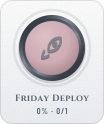</picture></a>
  <a href="https://github.com/tannergolden/trophies/blob/HEAD/docs/Catalogue.md#repository-alive"><picture><source media="(prefers-color-scheme: dark)" srcset="assets/trophies/achievements/alive.svg">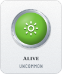</picture></a>
  <a href="https://github.com/tannergolden/trophies/blob/HEAD/docs/Catalogue.md#repository-long-game"><picture><source media="(prefers-color-scheme: dark)" srcset="assets/trophies/achievements/long-game.svg">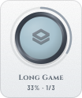</picture></a>
  <a href="https://github.com/tannergolden/trophies/blob/HEAD/docs/Catalogue.md#repository-same-day-fix"><picture><source media="(prefers-color-scheme: dark)" srcset="assets/trophies/achievements/same-day-fix.svg">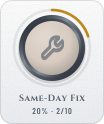</picture></a>
  <a href="https://github.com/tannergolden/trophies/blob/HEAD/docs/Catalogue.md#repository-monthly-release"><picture><source media="(prefers-color-scheme: dark)" srcset="assets/trophies/achievements/monthly-release.svg"></picture></a>
  <a href="https://github.com/tannergolden/trophies/blob/HEAD/docs/Catalogue.md#repository-streak"><picture><source media="(prefers-color-scheme: dark)" srcset="assets/trophies/achievements/streak.svg">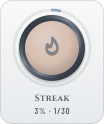</picture></a>
  <a href="https://github.com/tannergolden/trophies/blob/HEAD/docs/Catalogue.md#repository-marathon-day"><picture><source media="(prefers-color-scheme: dark)" srcset="assets/trophies/achievements/marathon-day.svg">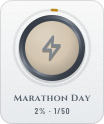</picture></a>
  <a href="https://github.com/tannergolden/trophies/blob/HEAD/docs/Catalogue.md#repository-weekly-beat"><picture><source media="(prefers-color-scheme: dark)" srcset="assets/trophies/achievements/weekly-beat.svg">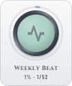</picture></a>
  <a href="https://github.com/tannergolden/trophies/blob/HEAD/docs/Catalogue.md#repository-big-week"><picture><source media="(prefers-color-scheme: dark)" srcset="assets/trophies/achievements/big-week.svg">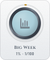</picture></a>
  <a href="https://github.com/tannergolden/trophies/blob/HEAD/docs/Catalogue.md#repository-comeback"><picture><source media="(prefers-color-scheme: dark)" srcset="assets/trophies/achievements/comeback.svg"></picture></a>
  <a href="https://github.com/tannergolden/trophies/blob/HEAD/docs/Catalogue.md#repository-night-shift"><picture><source media="(prefers-color-scheme: dark)" srcset="assets/trophies/achievements/night-shift.svg">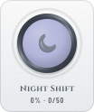</picture></a>
  <a href="https://github.com/tannergolden/trophies/blob/HEAD/docs/Catalogue.md#repository-weekend-project"><picture><source media="(prefers-color-scheme: dark)" srcset="assets/trophies/achievements/weekend-project.svg">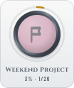</picture></a>
</p>

<p align="center"><b>Secret</b></p>
<p align="center">
  <a href="https://github.com/tannergolden/trophies/blob/HEAD/docs/Catalogue.md#repository-birthday"><picture><source media="(prefers-color-scheme: dark)" srcset="assets/trophies/achievements/birthday.svg"></picture></a>
  <a href="https://github.com/tannergolden/trophies/blob/HEAD/docs/Catalogue.md#repository-constellation"><picture><source media="(prefers-color-scheme: dark)" srcset="assets/trophies/achievements/constellation.svg"></picture></a>
  <a href="https://github.com/tannergolden/trophies/blob/HEAD/docs/Catalogue.md#repository-friday-the-13th"><picture><source media="(prefers-color-scheme: dark)" srcset="assets/trophies/achievements/friday-the-13th.svg"></picture></a>
  <a href="https://github.com/tannergolden/trophies/blob/HEAD/docs/Catalogue.md#repository-full-house"><picture><source media="(prefers-color-scheme: dark)" srcset="assets/trophies/achievements/full-house.svg"></picture></a>
  <a href="https://github.com/tannergolden/trophies/blob/HEAD/docs/Catalogue.md#repository-ghost"><picture><source media="(prefers-color-scheme: dark)" srcset="assets/trophies/achievements/ghost.svg"></picture></a>
  <a href="https://github.com/tannergolden/trophies/blob/HEAD/docs/Catalogue.md#repository-green-wall"><picture><source media="(prefers-color-scheme: dark)" srcset="assets/trophies/achievements/green-wall.svg"></picture></a>
  <a href="https://github.com/tannergolden/trophies/blob/HEAD/docs/Catalogue.md#repository-leap-day"><picture><source media="(prefers-color-scheme: dark)" srcset="assets/trophies/achievements/leap-day.svg"></picture></a>
  <a href="https://github.com/tannergolden/trophies/blob/HEAD/docs/Catalogue.md#repository-midnight-oil"><picture><source media="(prefers-color-scheme: dark)" srcset="assets/trophies/achievements/midnight-oil.svg"></picture></a>
  <a href="https://github.com/tannergolden/trophies/blob/HEAD/docs/Catalogue.md#repository-new-year"><picture><source media="(prefers-color-scheme: dark)" srcset="assets/trophies/achievements/new-year.svg"></picture></a>
  <a href="https://github.com/tannergolden/trophies/blob/HEAD/docs/Catalogue.md#repository-palindrome"><picture><source media="(prefers-color-scheme: dark)" srcset="assets/trophies/achievements/palindrome.svg"></picture></a>
  <a href="https://github.com/tannergolden/trophies/blob/HEAD/docs/Catalogue.md#repository-round-number"><picture><source media="(prefers-color-scheme: dark)" srcset="assets/trophies/achievements/round-number.svg"></picture></a>
  <a href="https://github.com/tannergolden/trophies/blob/HEAD/docs/Catalogue.md#repository-the-answer"><picture><source media="(prefers-color-scheme: dark)" srcset="assets/trophies/achievements/the-answer.svg"></picture></a>
</p>

</details>

<p align="center"><sub>Refreshed daily by <a href="https://github.com/tannergolden/trophies">tannergolden/trophies</a> · Every trophy and achievement, what it is for and how to earn it: <a href="https://github.com/tannergolden/trophies/blob/HEAD/docs/Catalogue.md#repository">the catalogue</a>. Click any card for its entry.</sub></p>
<!-- trophies:end -->

---

## 🚀 Use It In Your README

Add this as `.github/workflows/readme.yml` in any repository. That stub is
the whole interface.

```yaml
name: README
on:
  schedule:
    - cron: '7 0 * * *'
    - cron: '7 8 * * *'
    - cron: '7 16 * * *'
  workflow_dispatch:

permissions: {}

jobs:
  readme:
    permissions:
      contents: write
      pull-requests: write
    uses: tannergolden/markdown/.github/workflows/readme.yml@v1
    with:
      banners: '7 0 * * *'
      badges: '7 8 * * *'
      trophies: '7 16 * * *'
```

Run it once from the Actions tab. The banners put a header block at the top
of your README and a footer block at its foot, the elements write a data
file with the four elements that need nothing by hand and put a pair of
markers for each at the foot, and the trophies put their block there too;
every kit draws into its own folder under `assets/` and commits. Move any
pair of markers wherever you like: later runs rewrite only what is between
them, and each kit writes only between its own. The badges wait for a
[`.github/badges.yml`](https://github.com/tannergolden/badges/blob/Development/docs/badges.example.yml),
since only you know which badges a page should carry, and say so in the
run's log until it exists.

Drop a kit by deleting its cron in both places. Keep the minutes off the
hour, as they are here: GitHub delays scheduled runs that pile up at `:00`,
and a delayed run costs nothing, since the next one measures everything
again, but an odd minute makes the delays rarer.
[`examples/stub.yml`](examples/stub.yml) is the stub above with its options.

### Or gate on it

Everything the kits draw is committed files, so it can be checked like any
other. With `check: true` the same workflow measures nothing and commits
nothing: every kit the stub names redraws from its lock and the run fails
if any file or README block differs from what the kit draws. No token is
used, and the caller grants `contents: read` and nothing more, so it runs
on a pull request from a fork:
[`examples/stub-check.yml`](examples/stub-check.yml).

### Options

The workflow takes, besides the three crons:

| Input      | Default                          | Meaning                                                                                                    |
| :--------- | :------------------------------- | :--------------------------------------------------------------------------------------------------------- |
| `elements` | `true`                           | Draw the elements in the banners slot, after the banners. `false` leaves the banners alone in their slot.  |
| `mode`     | `repository`                     | `repository`, or `profile` in the repository named after your account. The banners and the trophies both take it. |
| `theme`    | the banners' config              | The print the banners are drawn in, `blueprint` by default, or `rainbowprint`.                              |
| `style`    | the trophies' config             | `trophy`, `crest`, `medallion`, `crystal` or `plaque`.                                                      |
| `author`   | the kits' author                 | Who each refresh commit is by, as `Name <email>`.                                                           |
| `check`    | `false`                          | Verify what is committed instead of refreshing it.                                                          |

Each kit still reads its own config file, so `.github/banners.yml`,
`.github/badges.yml`, `.github/trophies.yml` and `.github/elements.yml` set
everything the kit can set, exactly as they would under the kit's own stub.
Optional tokens are passed through under the kits' own names,
`BANNERS_TOKEN`, `TROPHIES_TOKEN` and `ELEMENTS_TOKEN`; nothing on a
repository's own page needs one.

---

## 🧰 The Kits

<div align="center">

<!-- elements:banners:start -->
<a href="https://github.com/tannergolden/banners">
<picture>
  <source media="(prefers-color-scheme: dark)" srcset="assets/elements/banners-dark.svg">
  
</picture>
</a>
<!-- elements:banners:end -->
<!-- elements:badges:start -->
<a href="https://github.com/tannergolden/badges">
<picture>
  <source media="(prefers-color-scheme: dark)" srcset="assets/elements/badges-dark.svg">
  
</picture>
</a>
<!-- elements:badges:end -->

<!-- elements:trophies:start -->
<a href="https://github.com/tannergolden/trophies">
<picture>
  <source media="(prefers-color-scheme: dark)" srcset="assets/elements/trophies-dark.svg">
  
</picture>
</a>
<!-- elements:trophies:end -->
<!-- elements:standards:start -->
<a href="https://github.com/tannergolden/standards">
<picture>
  <source media="(prefers-color-scheme: dark)" srcset="assets/elements/standards-dark.svg">
  
</picture>
</a>
<!-- elements:standards:end -->

</div>

---

## 🧭 Layout

```bash
markdown/
├── .github/workflows/readme.yml            the reusable workflow your stub calls
├── .github/workflows/own-readme.yml        this page's own stub, at the same three crons
├── .github/workflows/own-readme-check.yml  the check, on a pull request
├── .github/workflows/cut-release.yml       cuts a version and moves v1, via the standards
├── .github/banners.yml                     this page's banners config, and the lock beside it
├── .github/badges.yml                      this page's badges
├── .github/trophies.yml                    this page's trophies config, and the ledger beside it
├── .github/elements.yml                    this page's elements, and the lock beside it
├── .github/scripts/                        the repository's own checks, and the slot picker's test
├── assets/banners/, badges/, trophies/, elements/   what every kit drew for this page
├── examples/                               the stub and the check stub to copy
└── .github/docs/                           the seeded documents every repository carries
```

---

## 🛠️ Working On It

Consuming this needs nothing but the stub above. For the repository itself:

```bash
python3 .github/scripts/validate-repository.py                    # every YAML and JSON file, every pin, every line ending
python3 -m unittest discover -s .github/scripts -p 'test_*.py'    # the slot picker under every event, and the scaffold's own checks
```

The slot picker lives inside the workflow, because a reusable workflow runs
against the caller's checkout where nothing of this repository is on disk;
its test lifts the script out of the YAML and runs it under every event.
A version is cut by dispatching **🏷️ Cut Release** with `vX.Y.Z`: the
standards' release workflow proves the workflow and the stubs exist at the
commit and that the checks pass, then tags the version and moves `v1`.

---

## 📄 License

MIT. See [`LICENSE`](LICENSE). Every image on this page was drawn by one of
the four kits, under their licences.

---

## 🔗 See also

> [!TIP]
> [`tannergolden/banners`](https://github.com/tannergolden/banners) draws the
> header, the footer and the body of the page,
> [`tannergolden/badges`](https://github.com/tannergolden/badges) its badges,
> and [`tannergolden/trophies`](https://github.com/tannergolden/trophies) its
> case. Each can be called on its own, with its own stub; this calls all of
> them with one. The engineering standards they follow are published in
> [`tannergolden/standards`](https://github.com/tannergolden/standards).

<div align="center">

<!-- elements:stamp:start -->
<picture>
  <source media="(prefers-color-scheme: dark)" srcset="assets/elements/stamp-dark.svg">
  
</picture>
<!-- elements:stamp:end -->

</div>

<!-- banners:footer:start -->
<div align="center">

<a href="#top">
<picture>
  <source media="(max-width: 585px) and (prefers-color-scheme: dark)" srcset="assets/banners/footer-narrow-dark.svg">
  <source media="(max-width: 585px)" srcset="assets/banners/footer-narrow-day.svg">
  <source media="(prefers-color-scheme: dark)" srcset="assets/banners/footer-dark.svg">
  
</picture>
</a>

<a href="https://github.com/tannergolden/markdown/issues"><picture><source media="(prefers-color-scheme: dark)" srcset="assets/banners/link-issues-dark.svg"></picture></a>
<a href="https://github.com/tannergolden/markdown/pulls"><picture><source media="(prefers-color-scheme: dark)" srcset="assets/banners/link-pull-requests-dark.svg"></picture></a>
<a href="https://github.com/tannergolden/markdown/releases"><picture><source media="(prefers-color-scheme: dark)" srcset="assets/banners/link-releases-dark.svg"></picture></a>
<a href="https://github.com/tannergolden/markdown/actions"><picture><source media="(prefers-color-scheme: dark)" srcset="assets/banners/link-actions-dark.svg"></picture></a>

</div>
<!-- banners:footer:end -->
