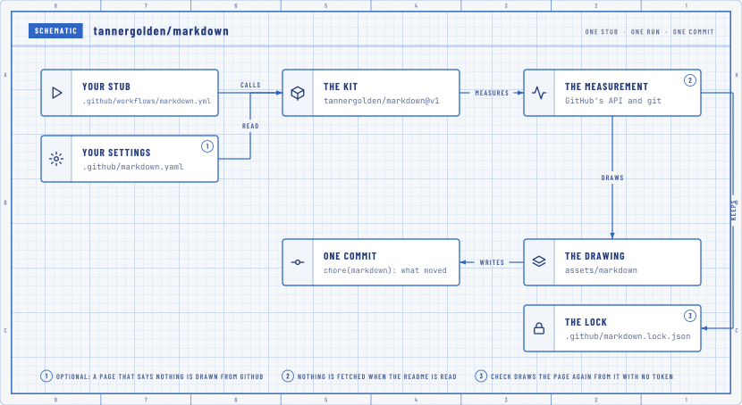

<!--
title: '📝 MARKDOWN'
description: 'A README''s header, footer, badges, body and trophy case, measured on a schedule and drawn as committed SVGs from one stub.'
tags: [readme, svg, banners, badges, trophies, github-actions]
category: docs
-->

<!-- markdown:header:start -->
<!-- markdownlint-disable MD041 -->

<div align="center">

<a name="top"></a>

# 📝 MARKDOWN

**A README's header, footer, badges, body and trophy case, from one stub.**

_Measured nightly. Drawn as committed SVG. Never fetched._

</div>
<!-- markdown:header:end -->

---

## 💡 What This Is

A README's images usually come from someone else's server: a stats card, a
badge service, a banner generator. Every one is a request on every page view,
and a dependency on that server's uptime for your page to render. A header
typed by hand is out of date the day your description changes.

This kit draws them instead, and keeps them current. One scheduled run
measures the page over GitHub's API and git, draws every image as an SVG,
writes the README's blocks, and commits the lot once:

| Part         | What it draws                                                                           |
| :----------- | :-------------------------------------------------------------------------------------- |
| **Banners**  | The header and the footer, and the links under the footer.                              |
| **Badges**   | A row of static badges, and a row of live ones whose value and colour the run measures. |
| **Elements** | The body: a schematic, instruments, milestones, a roster, a certificate, placards.      |
| **Trophies** | The trophy case: eight core trophies with their tiers, and a hundred achievements.      |

Every image is a **committed file**, served by GitHub with the rest of the
repository: up as long as the repository is, with nothing to rate-limit and no
third party in the path. The only thing on a schedule is the refresh, and a
refresh that is late or skipped changes nothing a reader sees.

A page is a person's profile or a repository. Organization pages are next.

---

## 👤 The Example: A Profile

[**tannergolden/tannergolden**](https://github.com/tannergolden/tannergolden),
my GitHub profile, is the example of all of it on a profile repository. Its
README is drawn by this kit every night at midnight EST, in profile mode, in
the `blackprint`, with the holidays on, from one stub and one settings file:

| Part         | On the profile                                                                                                                                                               |
| :----------- | :--------------------------------------------------------------------------------------------------------------------------------------------------------------------------- |
| **Banners**  | A header read from GitHub, the name and the bio, with a motto, a note and six figures; a footer with its closing words, and four buttons under it.                           |
| **Badges**   | Four static badges, and two live ones the run measures: whether the standards pass their own checks, and how long ago the last commit was.                                   |
| **Elements** | A schematic of how its repositories fit together, written by hand, and placards for the two latest releases and two good first issues, which its own scripts rewrite weekly. |
| **Trophies** | The case in profile mode: five core trophies in one row, the level and next-up cards over them, and the achievements under them.                                             |

Its stub is the one below with `mode: profile` and `theme: blackprint`, and
[its settings](https://github.com/tannergolden/tannergolden/blob/Development/.github/markdown.yaml)
set up every part, with a comment on each. This README is the other example:
this repository's own page, in repository mode, in the `blueprint`, with the
holidays on and its trophy case over the footer.

---

## 🚀 One Stub

Your repository holds one small workflow that names the schedule. The
checkout, the measurement, the drawing and the commit all happen here, so a fix
lands once and reaches every README pinned to `v1`.

```yaml
# .github/workflows/markdown.yml
name: '📝 Markdown'

on:
  schedule:
    - cron: '0 0 * * *'   # every night at midnight UTC
  workflow_dispatch:

permissions: {}

jobs:
  markdown:
    permissions:
      contents: write        # the images, the README's blocks and the lock
      pull-requests: write   # only used with commit: pr
    uses: tannergolden/markdown/.github/workflows/markdown.yml@v1
    secrets: inherit
```

That is the whole setup. With no settings at all, the page gets a header and a
footer read from GitHub and a trophy case, in the `standard` theme, with the
holidays on. The stub can set the choices made most often:

| Input           | Default          | What it does                                                                |
| :-------------- | :--------------- | :-------------------------------------------------------------------------- |
| `mode`          | (guessed)        | `profile` or `repository`. A repository named after its owner is a profile. |
| `theme`         | `standard`       | `standard`, a print, `rainbowprint`, or a print of your own.                |
| `holidays`      | `true`           | `'false'` keeps the holiday sets away.                                      |
| `holiday-days`  | `3`              | How long each holiday's set is up, 3 to 7 days.                             |
| `check`         | `false`          | Only check that the committed page is current. See below.                   |
| `commit`        | `push`           | `pr` opens or updates one pull request instead of pushing.                  |
| `commit-branch` | `chore/markdown` | The branch that pull request rides on.                                      |

Everything else a page can set lives in `.github/markdown.yaml`, and
[`docs/Settings.md`](docs/Settings.md) has every key.

> [!TIP]
> **`MARKDOWN_TOKEN` is optional.** `GITHUB_TOKEN` reads everything public, so
> a public page needs nothing. A read-only personal token saved as
> `MARKDOWN_TOKEN` is read instead when it is there, which also lets a profile
> count private contributions (`trophies: private: true`).

---

## 🧭 How A Run Draws A Page

<!-- markdown:element:how-it-runs:start -->
<picture>
  <source media="(max-width: 585px) and (prefers-color-scheme: dark)" srcset="assets/markdown/elements/how-it-runs-narrow-dark.svg">
  <source media="(max-width: 585px)" srcset="assets/markdown/elements/how-it-runs-narrow-day.svg">
  <source media="(prefers-color-scheme: dark)" srcset="assets/markdown/elements/how-it-runs-dark.svg">
  
</picture>
<!-- markdown:element:how-it-runs:end -->

Each run measures everything again, so a run GitHub delays or drops loses
nothing: the next one catches up. A day on which nothing the page shows has
moved writes nothing at all. When something did move, the commit says what:

```text
chore(markdown): 🪧 redraw with release v1.4.0 and 212 stars

Measured octo/drift on 2026-10-03. The header reads DRIFT, with project
octo/drift, release v1.4.0, 212 stars, 18 forks, 3 open issues, language
Rust and license MIT. The footer dates the last change 2026-10-01.

Changed since the last drawing: release v1.4.0 (was v1.3.2) and 212
stars (was 198).
```

The kit owns only what sits between its markers in the README, so every word
of yours around them stays yours. On a first run the header goes at the top,
the badges under it, the trophy case over the footer and the footer at the
foot; an element goes where you put its markers.

---

## 🎨 One Theme For The Whole Page

One setting colours everything, so the header, the badges and the body read as
one family:

- **`standard`**, the default: the original badges' own look at the size of a
  header. Its header opens with one badge the width of the page, the title in
  its black and the release in its accent, and its figures stand along the foot
  as the badges a README would carry for them. Every letter holds 4.5:1 against
  its ground.
- **Eleven prints**, the colours a drawing is reproduced in: `redprint`
  through `pinkprint` along the spectrum, `blueprint` among them, then
  `brownprint` and `blackprint`. Each draws the page as a drafting sheet, its
  lines on white by day and its sheet by night.
- **`rainbowprint`** moves to the next colour of the spectrum each time
  something the page shows changes.
- **Your own prints**, a name and three colours in the settings.

The header, the footer and the body each come as a **day** file and a
**dark** file, and the README shows one through a `<picture>` that follows the
reader's theme, with a still file for reduced motion and a narrow one for a
phone.

Around each holiday its own set takes over the page, then hands it back: New
Year's Day, Valentine's Day, Juneteenth, Independence Day, Halloween,
Thanksgiving and Christmas. A set redraws the banners, the badges and the
elements as pixel art, in the same files. Halloween's set is drawn; the other
six arrive in the releases that draw them.

---

## 🔍 Checking A Page

The lock, `.github/markdown.lock.json`, keeps what each run measured. So the
committed page can be drawn again with no token and no network, and compared
with what is committed: a hand-edited image, a missing one, a README block that
drifted, or settings changed without a run all show up. For pull-request CI:

```yaml
on: pull_request

jobs:
  page:
    permissions:
      contents: write
      pull-requests: write
    uses: tannergolden/markdown/.github/workflows/markdown.yml@v1
    with:
      check: true
```

---

## 🖥️ On Your Own Machine

The kit is standard-library Python, 3.10 or later, with nothing to install:

```bash
python3 src/markdown-kit.py preview --root /tmp/page       # a sample page, the way a run draws it
python3 src/markdown-kit.py settings --root .              # a repository's settings, every default filled in
python3 src/markdown-kit.py check --root .                 # is the committed page current?
python3 src/markdown-kit.py set --root . status=Paused     # write a badge's value into the settings
python3 src/markdown-kit.py holidays --year 2026 --days 5  # every holiday's window
```

`python3 src/markdown-kit.py --help` lists the rest: `run`, `render`,
`measure`, `lint`, `catalogue`, `calibrate`, `palette`, `icons` and `version`.

---

## 📦 What's Inside

| Path                             | Purpose                                                                                                      |
| :------------------------------- | :----------------------------------------------------------------------------------------------------------- |
| `.github/workflows/markdown.yml` | **The workflow** every stub calls: checkout, the kit, the commit                                             |
| `actions/markdown/`              | **The action** the workflow runs: one run of the kit on the checkout                                         |
| `src/markdown-kit.py`            | **The kit's** command line, and the one place its layers meet                                                |
| `src/domain/`                    | What a page looks like: the palette, the lettering, the themes and every drawing                             |
| `src/app/`                       | What a run does: the settings, the measurement, the plan and the commit                                      |
| `src/infra/`                     | Files, git, GitHub's API, the clock, and the kit's data files                                                |
| `docs/`                          | [Settings](docs/Settings.md), the trophies' [catalogue](docs/Catalogue.md), and the decisions behind the kit |
| `tests/`                         | Unit, integration and end-to-end suites, and the fixtures they check against                                 |

`make lint test` runs everything CI runs, and `make draw` draws a sample profile
and a sample repository page into `preview/`, which git leaves alone.
[`docs/technical/Source-Code.md`](docs/technical/Source-Code.md) lays out the
layers and the rules between them.

---

## 🌿 How The Workflows Work

Most workflows here are **triggers**. Their logic lives in
[`tannergolden/standards`](https://github.com/tannergolden/standards) and is
pulled in by `uses:`. GitHub only runs a workflow that lives in the repository
being pushed to, which is why these small files exist here at all. They are
grouped by what they do, so one push produces one run with every check in it.
Four are the kit's own: the workflow every page calls, this repository's own
page, the release, and the calibration.

| Workflow                   | Gives you                                                                |
| :------------------------- | :----------------------------------------------------------------------- |
| `markdown.yml`             | The reusable workflow every page's stub calls                            |
| `own-page.yml`             | This README, drawn every night by the kit it documents                   |
| `cut-release.yml`          | Cuts `vX.Y.Z` and moves `v1`, by calling the standards                   |
| `calibrate.yml`            | Measures, each quarter, the repositories the trophies are set against    |
| `checks.yml`               | The gates: lint/test/build, secret scan, CodeQL, workflow lint           |
| `governance.yml`           | PR title and DCO checks, onboarding, triage, stale sweep, slash commands |
| `release.yml`              | Draft notes, publish assets, registries, prune superseded releases       |
| `maintenance.yml`          | Prunes stale deployments; deletes draft releases on request              |
| `prune-runs.yml`           | Prunes workflow run history, with its logs and artifacts                 |
| `lifecycle.yml`            | Claims this repository once; tells you when a new major exists           |
| `dependabot-automerge.yml` | Approves and queues Dependabot's patch and minor updates                 |
| `ci-failure-alert.yml`     | Opens an issue when a watched workflow fails, closes it on green         |
| `apply-standards.yml`      | Dispatch-only. The label taxonomy and branch protection                  |
| `auto-format.yml`          | Formats what a push touched                                              |
| `preview-deploy.yml`       | Deploys pushes to a preview target, once one is configured               |
| `verify-stubs.yml`         | Proves every job's permission ceiling matches its called workflow        |

**Do not rename the job ids** `ci` and `secrets` (in `checks.yml`) or `pr`
(in `governance.yml`). A called workflow reports its checks as
`<job id> / <job name>`, so branch protection depends on them - the file a
job lives in does not matter, but its id does.

> [!IMPORTANT]
> **🎯 Apply Standards needs a token for two of its three jobs.** Applying the
> label taxonomy needs nothing. **Writing the settings and the rulesets** each
> need a token with administration write as `ADMIN_TOKEN`. Without it, those
> jobs stop with a sentence naming the missing token instead of a bare `403`.
>
> A fine-grained token scoped to your repositories generated from the
> templates, with **Administration: Read and write** and nothing else, is all
> it needs. Step-by-step:
> [Creating the ADMIN_TOKEN](https://github.com/tannergolden/standards/blob/Development/docs/operations/Branch-Protection.md#-creating-the-admin_token).
> You can skip it entirely by applying the settings and rulesets yourself,
> where your own rights are already enough.

### Staying current takes no effort

`@v1` is a **moving major tag**, both ways. Every fix in the kit's v1 line
reaches every README whose stub pins `v1` the next time it runs, and every fix
in the standards' v1 line reaches the workflows here the moment it is
published. Breaking changes never arrive that way, because a new major is a
different tag.

---

## 📚 The Standards

Everything about how to branch, review, release, and secure a repository lives
in the [Standards Index](https://github.com/tannergolden/standards/blob/Development/docs/README.md).
This repository follows it **by link**.

---

<!-- markdown:footer:start -->
<div align="center">

**Drawn at both ends. Fetched at neither.**

[↑ Back to Top](#top)

<br />

Built with ❤️ by [@tannergolden](https://github.com/tannergolden). Distributed under the MIT License.

</div>
<!-- markdown:footer:end -->
